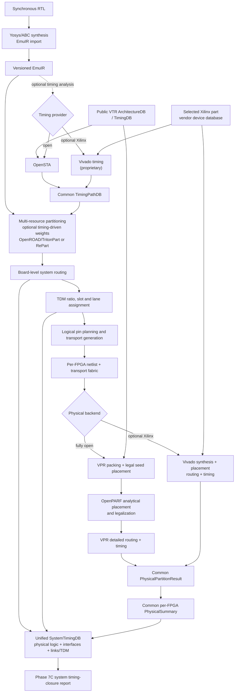

# EmuFlow

> [!IMPORTANT]
> ## Open-source source map
>
> Every selected open-flow engine is stored as editable source and built from
> this repository. This is the compact upstream-source index:
>
> - First-party EmuFlow:
>   [ZeayW/FGPA_emulation](https://github.com/ZeayW/FGPA_emulation)
>   under Apache-2.0
> - Synthesis: [Yosys](https://github.com/YosysHQ/yosys) and
>   [ABC](https://github.com/YosysHQ/abc), including
>   [cxxopts](https://github.com/jarro2783/cxxopts) and
>   [MiniSat](https://github.com/niklasso/minisat)
> - Timing and partitioning:
>   [OpenROAD](https://github.com/The-OpenROAD-Project/OpenROAD),
>   [OpenSTA](https://github.com/The-OpenROAD-Project/OpenSTA), and
>   [RePart](https://github.com/Welement-zyf/RePart), with OpenROAD's retained
>   [ABC](https://github.com/The-OpenROAD-Project/abc),
>   [FastRoute](https://github.com/The-OpenROAD-Project/OpenROAD/tree/master/src/grt/src/fastroute),
>   [Flute3](https://github.com/The-OpenROAD-Project/OpenROAD/tree/master/src/stt/src/flt),
>   [Munkres](https://github.com/The-OpenROAD-Project/OpenROAD/tree/master/src/ppl/src/munkres),
>   and [Material Design Icons](https://github.com/google/material-design-icons)
> - Placement: [OpenPARF](https://github.com/PKU-IDEA/OpenPARF)
> - Default open academic backend:
>   [VTR/VPR](https://github.com/verilog-to-routing/vtr-verilog-to-routing)
>   editable pack/place/route source plus the flagship heterogeneous XML,
>   pinned by commit and SHA-256; materialized dependencies are
>   [pugixml](https://github.com/zeux/pugixml),
>   [libsdcparse](https://github.com/verilog-to-routing/libsdcparse) and
>   [yaml-cpp](https://github.com/jbeder/yaml-cpp)
> - Architecture interchange:
>   [FPGA Interchange Schema](https://github.com/chipsalliance/fpga-interchange-schema),
>   [Cap'n Proto](https://github.com/capnproto/capnproto), and the required
>   [capnproto-java schema](https://github.com/capnproto/capnproto-java)
>   ([RapidWright](https://github.com/Xilinx/RapidWright) is an optional
>   DeviceResources producer, not an open EmuFlow engine, because its current
>   API-library dependency includes Xilinx-EULA-governed material)
> - Decision diagrams: [CUDD](https://github.com/ivmai/cudd)
> - OpenPARF bundled source:
>   [Ccache.cmake](https://github.com/TheLartians/Ccache.cmake),
>   [Blend2D](https://github.com/blend2d/blend2d),
>   [GoogleTest](https://github.com/google/googletest),
>   [LEMON](https://github.com/The-OpenROAD-Project/lemon-graph),
>   [pugixml](https://github.com/zeux/pugixml),
>   [pybind11](https://github.com/pybind/pybind11),
>   [rapidcsv](https://github.com/d99kris/rapidcsv), and
>   [yaml-cpp](https://github.com/jbeder/yaml-cpp)
> - Retained disabled OpenPARF router source:
>   [clipp](https://github.com/muellan/clipp),
>   [gdstk](https://github.com/heitzmann/gdstk),
>   [Qhull](https://github.com/qhull/qhull),
>   [Clipper](https://sourceforge.net/projects/polyclipping/), and
>   [Taskflow](https://github.com/taskflow/taskflow)
> - External build/runtime dependencies:
>   [CMake](https://github.com/Kitware/CMake),
>   [GNU Make](https://git.savannah.gnu.org/cgit/make.git),
>   [GCC](https://github.com/gcc-mirror/gcc) or
>   [LLVM/Clang](https://github.com/llvm/llvm-project),
>   [Python](https://github.com/python/cpython),
>   [Boost](https://github.com/boostorg/boost),
>   [Bison](https://git.savannah.gnu.org/cgit/bison.git),
>   [Flex](https://github.com/westes/flex),
>   [Tcl](https://github.com/tcltk/tcl),
>   [SWIG](https://github.com/swig/swig),
>   [Eigen](https://gitlab.com/libeigen/eigen),
>   [zlib](https://github.com/madler/zlib),
>   [spdlog](https://github.com/gabime/spdlog),
>   [LEMON](https://github.com/The-OpenROAD-Project/lemon-graph),
>   [OR-Tools](https://github.com/google/or-tools),
>   [PyTorch](https://github.com/pytorch/pytorch),
>   [NumPy](https://github.com/numpy/numpy),
>   [PyYAML](https://github.com/yaml/pyyaml),
>   [Hummingbird](https://github.com/microsoft/hummingbird),
>   [NetworkX](https://github.com/networkx/networkx), and
>   [tqdm](https://github.com/tqdm/tqdm)
> - RTL benchmarks:
>   [SERV](https://github.com/olofk/serv),
>   [PicoRV32](https://github.com/YosysHQ/picorv32),
>   [secworks AES](https://github.com/secworks/aes),
>   [Ibex](https://github.com/lowRISC/ibex),
>   [VTR/Koios](https://github.com/verilog-to-routing/vtr-verilog-to-routing),
>   [VeeR EH1](https://github.com/chipsalliance/Cores-VeeR-EH1), and
>   [NVDLA](https://github.com/nvdla/hw)
> - Public multi-FPGA benchmark specifications:
>   [ICCAD 2019 system-level FPGA routing with TDM](https://www.iccad-contest.org/2019/problems.html),
>   [2023 EDA Elite FPGA die-level system routing](https://eda.icisc.cn/file/cacheFile/4f769715b1704172935438d418702f80.pdf),
>   with cases 01--09 mirrored at a fixed revision in
>   [FPGA-Die-Routing](https://github.com/heyiWF/FPGA-Die-Routing/tree/1f05cfd366b9565eb604380f5feed38b25baaff7/TestCase20231027)
>   and case 10 fetched from the
>   [official 2023 contest archive](https://edaicisc.oss-cn-shanghai.aliyuncs.com/file/eventDocuments/sierxinsaishuju.zip)
>   linked by the
>   [official retrospective](https://cpipc.acge.org.cn/cw/contestPrevious/detail/2c9080158ee9c272018f229208b610a6/2c9080158f815e21018fba6202d92461?page=1)
>   (benchmark files only; participant source is not incorporated),
>   [2024 EDA Elite hypergraph partitioning with logic replication](https://edaoss.icisc.cn/file/cacheFile/2024/8/1/8e6b33de567b411d8b159b961ef117aa.pdf),
>   its fixed-commit public cases in
>   [RePart](https://github.com/Welement-zyf/RePart/tree/211a9d8fd526576387cad7ac6dd3531354aeb31c/testcase),
>   and the
>   [2025 EDA Elite reconfigurable multi-FPGA routing problem](https://edaoss.icisc.cn/file/cacheFile/2025/8/11/1e213a00cbd94e2b91e997740753cb60.pdf),
>   with its public cases 01--04 fetched from the MIT-licensed
>   [EDA-2025-git repository at a fixed commit](https://github.com/nsyw705/EDA-2025-git/tree/45315b739e6678bf04605aaa246285c768bc8e13/data_case)
>   using per-file SHA-256 verification (benchmark inputs only; participant
>   algorithms and the opaque checker binary are not incorporated)
> - Public hardware-architecture data:
>   the non-confidential
>   [Arm MPS4 technical reference manual](https://documentation-service.arm.com/static/669a306a43b8ec1e18652768)
>   for the three-board topology, ARC6/GTY links, connectors, and package pins,
>   plus AMD
>   [DS890](https://docs.amd.com/r/en-US/ds890-ultrascale-overview/Virtex-UltraScale-FPGA-Feature-Summary)
>   for XCVU13P resource capacity
> - CI:
>   [actions/checkout](https://github.com/actions/checkout) and
>   [actions/setup-python](https://github.com/actions/setup-python)
> - Optional proprietary provider (not bundled or open source):
>   [AMD Vivado](https://www.amd.com/en/products/software/adaptive-socs-and-fpgas/vivado.html)
>
> See the **[complete source, revision, and license inventory](OPEN_SOURCE_COMPONENTS.md)**
> for every nested component and dependency. The corresponding
> [machine-readable inventory](OPEN_SOURCE_COMPONENTS.json) is enforced by CI.

EmuFlow is a research-oriented, open multi-FPGA emulation flow. Its purpose is
to compile one synchronous RTL design into multiple FPGA implementations and a
deterministic communication fabric while keeping every stage inspectable,
replaceable, and independently verifiable.

The default research backend uses a fully public VTR academic architecture
model; no commercial board, FPGA database, or Vivado installation is required.
An optional Vivado provider implements the same timing and physical-result
contracts for a concrete Xilinx part. Vivado is proprietary, is not bundled,
and is never required by the default open path.

## Flow roadmap

The timing provider and physical backend are selected independently. Both
physical backends consume the same board-independent multi-FPGA result and
must produce the same provider-neutral result contracts.



The solid main path works without timing-driven optimization; `TimingPathDB`
adds timing weights to partitioning, system routing, and TDM. On the fully
open route, the VTR architecture supplies public resource and delay data,
OpenSTA supplies pre-partition optimization timing, OpenPARF performs
placement, and VPR performs exact packing, detailed routing, and post-route
timing. On the Vivado route, Vivado supplies device timing and physical
implementation for a concrete Xilinx part; Vivado itself and its device
database are not included in this repository. Phase 7C does not compare the
local OpenPARF/VPR or Vivado WNS values directly. It combines each scheduled
hop's routed TX/RX endpoint delays with the same concrete board route and TDM
schedule. Both physical backends additionally back-annotate continuous
original-STA endpoint chains through routed FPGA logic. TimingPathDB endpoint
identities let partition projection retain the actual sink of each multicast
member and discard local fanout of otherwise-global nets; provider inputs
without resolvable endpoints retain an explicit conservative per-partition
bound.
Both original-target-clock and virtual-runtime-clock system slack are
reported.

| Route | Current completion boundary |
| --- | --- |
| Common multi-FPGA frontend | Implemented through partitioning, system routing, TDM, logical pin planning, transport generation, per-FPGA splitting, and independent checks |
| Fully open physical route | Implemented through unified cross-FPGA physical/TDM timing and exercised end to end on a large, four-FPGA Koios DLA design using VPR → OpenPARF → VPR |
| Vivado physical route | Implemented and exercised end to end on a large, four-FPGA Koios DLA design, including unified cross-FPGA timing, routed DUT logic segments, and stable RAMB endpoint recovery |
| Bitstream and board bring-up | Outside the current completion gate; requires a concrete board support package |

The flow is board-abstracted. Synthesis, partitioning, routing, TDM, logical
pin assignment, and virtual-platform physical validation can run before a
board is selected. Package-pin binding, board clocks, shell integration,
bitstream generation, and hardware bring-up require a concrete board support
package.

## Why EmuFlow

Commercial prototyping tools tightly couple their intermediate formats and
optimization engines. EmuFlow instead uses versioned artifacts and independent
checkers between stages. This makes it possible to:

- study partitioning, system routing, TDM, pin assignment, and placement as
  separate optimization problems;
- compare academic algorithms without changing the rest of the flow;
- reproduce quality-of-result experiments on real RTL designs;
- validate feasibility and semantics independently of the optimizer that
  produced a result; and
- add a board later without rebuilding the board-independent frontend.

## Current scope

The current semantic model supports a single virtual DUT clock, synchronous
reset, deterministic static communication schedules, and lockstep execution
with a global frame barrier. Partition cuts are restricted to safe sequential
boundaries; combinational loops and hard macros remain atomic.

| Stage | Implementation source | Honest integration status |
| --- | --- | --- |
| Architecture database | In-tree C++ VTR XML importer; optional FPGA Interchange C++ importer | The default open VTR path imports layout, heterogeneous primitive capacity, primitive/interconnect arcs, switches, segments, and directs into provider-neutral ArchitectureDB/TimingDB artifacts; VPR consumes the original XML for exact mode-aware packing |
| Synthesis/import | In-tree Yosys/ABC plus EmuIR importer | The public VTR flagship profile maps LUT6/DFF logic, 9/18/36-bit multiplier modes, and inferred synchronous single/dual-port RAM modes from repository source |
| Static timing | In-tree standalone OpenSTA or optional external Vivado | Both emit the same `sta-path-database/v1` artifact. OpenSTA consumes the public Architecture TimingDB; Vivado uses the selected Xilinx part database |
| Partitioning | In-tree OpenROAD/TritonPart and RePart | Default providers build and run repository source |
| System routing | In-tree C++17 hybrid topology kernel plus independent checker and exact small-instance oracle | The academic provider evaluates shortest-path and DAC 2025-informed delay-demand-balanced multicast trees, then applies ASP-DAC 2026-informed timing-path rerouting. Hard SLL saturation is enforced during search; scaled utilization pressure balances scarce inter-die links |
| TDM | In-tree C++17 path-Lagrangian/KKT ratio optimizer, TODAES 2020 displacement DP, concrete scheduler, and independent checkers/oracles | Range-normalized KKT updates avoid numeric collapse on large timing scales. Exact/scalable legalization uses every physical lane, then global path-budget and per-domain minimax refinement cross quantization plateaus; concrete scheduling and independent checks enforce direction, ratio, collision, barrier, and transport semantics |
| Netlist/transport | In-tree generator, RTL, simulator, and checker | Working source implementation |
| Pin planning | In-tree C++17 grouping plus sparse min-cost-flow package-pin binding | Virtual planning and synthetic-BSP validation work; real board sign-off awaits a BSP |
| Placement | Root-built OpenPARF or optional external Vivado | The open provider runs VPR packing followed by OpenPARF analytical placement/legalization; the Vivado provider runs vendor placement for a concrete Xilinx part |
| FPGA routing/timing | Root-built VTR/VPR or optional external Vivado | Both providers must pass the common cell-accounting, zero-unrouted-net, zero-DRC, clock, and timing-result contract before Phase 7C; Phase 6 boundary IDs key exact routed TX source-to-port and RX port-to-shadow-register delays returned by either provider |
| Proprietary provider | First-party adapters/Tcl plus external Vivado | Selectable but not source-complete; produces vendor-device implementation results, not board/bitstream sign-off |
| Hardware BSP | In-tree contract plus source-backed Arm MPS4 topology/pin inventory | MPS4 BoardDB is available; GTY protocol wrapper, clock/reset shell, bitstream, and hardware qualification remain open gates |

`emuflow multi-fpga compile` is the board-independent multi-FPGA integration
gate. Its default public VTR mapping preserves multiplier and synchronous
single/dual-port RAM hard blocks while mapping remaining logic to LUT6/FF. It
then binds EmuIR import, partitioning, system routing, TDM scheduling,
per-FPGA splitting, transport generation, independent checks, and
cycle-equivalence in one report.

`emuflow vpr fpga-open` is the separate integration gate for one FPGA's open
physical backend. It binds synthesis, baseline VPR packing and
auto-layout sizing, ArchitectureDB/TimingDB import, OpenPARF placement, final
VPR routing, and the independent route checker in one versioned report.

The open heterogeneous OpenPARF-to-VPR placement-and-routing path is
implemented for the pinned VTR flagship profile: VTR architecture import,
LUT6/DFF plus multiplier/RAM mapping, exact VPR packing, the checked
packed-cluster contract, OpenPARF placement, VPR placement handoff, detailed
routing, timing analysis, independent route/RR-graph verification, and
endpoint-keyed interface timing extracted directly from VPR's routed Tatum
graph. Additional architecture mapping profiles remain open gates.
EmuFlow does not claim an open Xilinx bitstream flow. The Vivado provider ends
at routed checkpoints and timing reports; success there cannot satisfy the
default open-flow completion gate or replace board-level sign-off.

## Design principles

- **Versioned boundaries:** EmuIR, BoardDB, ArchitectureDB, placement,
  transport, physical boundary identity/timing, lane-map, and BSP artifacts
  have explicit schemas.
- **Independent correctness gates:** coverage, capacity, cut legality,
  reachability, link capacity, scheduling, placement, routing, and cycle
  behavior are checked separately from optimization.
- **Provider-based algorithms:** optimization engines can be replaced while
  preserving the surrounding artifact contracts and checkers.
- **Deterministic experiments:** fixed inputs and seeds produce auditable
  outputs with tool revisions, configurations, hashes, runtime, and memory.
- **Board abstraction:** logical communication planning is separated from
  package pins and hardware-specific shell constraints.

## Build

The supported entry point is the root CMake project. The default `release`
preset builds the first-party C++ kernels and all selected in-tree engines:
Yosys/ABC, CUDD, standalone OpenSTA, RePart, OpenROAD/TritonPart, OpenPARF,
VTR/VPR, and the VTR and FPGA Interchange ArchitectureDB importers.
It does not download any flow engine or install a precompiled provider.

All builds require:

- CMake 3.20 or newer, GNU Make, and a C++17 compiler;
- Python 3.9 or newer as the orchestration and checker runtime; and
- Boost `system`, `thread`, and `serialization`.

The complete default build additionally needs the development packages used by
OpenROAD and OpenPARF: Bison, Flex, Tcl, SWIG 4, Eigen3, zlib, spdlog, LEMON,
OR-Tools C++, OpenMP, PyTorch, NumPy, PyYAML, and Hummingbird. CUDA is optional
and disabled by default. GUROBI is not required because OpenPARF's experimental
router is disabled.

Configure, compile, and test from the repository root:

```bash
cmake --preset release
cmake --build --preset release --parallel
ctest --preset release
```

The build is self-contained below `build/native/`. Its main products are:

```text
build/native/install/bin/emuflow
build/native/install/bin/emuflow_vtr_arch_importer
build/native/install/bin/emuflow_fpgaif_arch_importer
build/native/install/bin/yosys
build/native/install/bin/yosys-abc
build/native/install/bin/vpr
build/native/install/bin/repart
build/native/install/bin/sta
build/native/install/bin/openroad
build/native/install/bin/emuflow_tlr_router
build/native/install/bin/emuflow_tdm_ratio_optimizer
build/native/install/bin/emuflow_tdm_partition_feedback
build/native/install/bin/emuflow_pin_planner
build/native/install/bin/emuflow_bsp_pin_solver
build/native/install/openparf/
```

Dependencies installed in a non-system prefix can be exposed without changing
the source tree:

```bash
cmake --preset release \
  -DEMUFLOW_CMAKE_PREFIX_PATH=/absolute/path/to/dependency-prefix \
  -DEMUFLOW_OPENPARF_PYTHON=/absolute/path/to/python
```

The selected Python must be the same interpreter and PyTorch ABI used when
OpenPARF's C++ operators are compiled; merely being able to import a different
PyTorch installation is insufficient. Set
`EMUFLOW_OPENPARF_ENABLE_CUDA=ON` only when that PyTorch installation and the
CUDA toolkit are compatible. See the upstream links and license information in
[Open-source components and provenance](OPEN_SOURCE_COMPONENTS.md).

For fast work on EmuFlow's first-party kernels and artifact contracts, a
developer may explicitly disable the large imported engines. This is a partial
developer build, not the source-complete release configuration:

```bash
cmake -S . -B build/core -DCMAKE_BUILD_TYPE=Release -DBUILD_TESTING=ON \
  -DEMUFLOW_BUILD_YOSYS=OFF \
  -DEMUFLOW_BUILD_CUDD=OFF \
  -DEMUFLOW_BUILD_REPART=OFF \
  -DEMUFLOW_BUILD_OPENROAD=OFF \
  -DEMUFLOW_BUILD_OPENSTA=OFF \
  -DEMUFLOW_BUILD_VPR=OFF \
  -DEMUFLOW_BUILD_OPENPARF=OFF
cmake --build build/core --parallel
ctest --test-dir build/core --output-on-failure
```

## Quick start

Quick Start uses the CLI produced by the root build; it does not perform an
editable package installation or bypass the installed launcher with a direct
Python module invocation. Add the local build products to `PATH`:

```bash
export PATH="$PWD/build/native/install/bin:$PATH"
emuflow --help
```

Fetch the pinned, SHA-256-verified VTR flagship architecture:

```bash
emuflow arch fetch-default-vtr \
  --output build/architectures/vtr-flagship.xml
```

Compile RTL through the board-independent multi-FPGA flow using the public
academic platform:

```bash
emuflow multi-fpga compile examples/rtl/counter.v \
  --top counter \
  --clock clk \
  --platform platforms/virtual/academic_vtr_2fpga_p2p.json \
  --out build/counter-multi-fpga
```

The command writes a hash-bound `multi-fpga-flow-report.json` only after
partition, route, schedule, split, and cycle-equivalence checks pass. The
default partition provider is the source-built OpenROAD/TritonPart engine.
The default `--mapping-profile vtr-hard-blocks` retains public VTR RAM/DSP
resources. `--mapping-profile generic-soft` is available for architecture-
neutral LUT6/FF experiments, but may expand memory-heavy designs substantially.
TritonPart assignments are legalized against the independently checked
cells/LUT/FF/BRAM/DSP balance bounds by default; pass
`--no-partition-repair-balance` only for an explicit raw-partitioner study.
For a design that naturally collapses into one zero-cut partition, pass
`--partition-repair-min-used-fpgas`; every repair move remains explicit in the
partition artifact and is checked independently.

### Public contest compatibility

EmuFlow keeps a contest's exact abstract machine model separate from BoardDB
instead of presenting it as a physical board. The 2023 EDA Elite adapter reads
the official `design.fpga.die`, `design.die.position`,
`design.die.network`, and `design.net` files, preserving the physical-FPGA to
die hierarchy, absolute SLL capacity, per-Wire direction, and ratio-4 TDM:

```bash
python3 scripts/fetch_eda2023_benchmarks.py \
  --case case1 --out build/benchmarks/eda2023/case1

emuflow contest eda2023-import \
  --case-dir build/benchmarks/eda2023/case1 \
  --name eda2023-case1 --out build/eda2023

emuflow phase4 \
  --assignment build/eda2023/partition_assignment.json \
  --platform build/eda2023/boarddb.json \
  --constraints build/eda2023/route_constraints.json \
  --timing-paths build/eda2023/contest_timing_paths.json \
  --out build/eda2023/routed

emuflow contest eda2023-optimize \
  --instance build/eda2023/contest_instance.json \
  --routes build/eda2023/routed/routes.json \
  --out build/eda2023/solution

emuflow contest eda2023-evaluate \
  --instance build/eda2023/contest_instance.json \
  --routes build/eda2023/routed/routes.json \
  --tdm-plan build/eda2023/solution/tdm_plan.json
```

The in-tree C++ router operates on dies, enforces hard SLL capacity during
search, and combines multicast delay with load pressure and the contest's
exact Wire TDM-delay model. Its initial timing weight is normalized from the
physical-FPGA graph diameter so capacity balance dominates short platforms
while accumulated TDM delay dominates long multi-hop platforms. The C++
Lagrangian/KKT ratio optimizer uses
range-normalized path multipliers, lane-budget-aware grouping, and global plus
per-domain minimax refinement to legalize signals into physical Wires with one
direction and one ratio per Wire. The independent checker recomputes multicast
paths, SLL capacity, Wire direction/ratio legality, and the published maximum
`RoutingWeight`; the optimizer also writes official `design.route.out` and
`design.tdm.out` files.

The normalized die hierarchy can also become an RTL-capable physical-FPGA
BoardDB. In this projection, intra-FPGA SLLs are absorbed into the device and
every inter-FPGA Wire bank remains a separate parallel shared-capacity link:

```bash
emuflow contest eda2023-materialize-boarddb \
  --instance build/eda2023/contest_instance.json \
  --device-template platforms/virtual/academic_vtr_4fpga_mesh.json \
  --name eda2023-case1-academic-rtl \
  --output build/eda2023/rtl-boarddb.json
```

The published Wire-bank capacity becomes the abstract lane count; optional
`--lane-scale` changes it explicitly. BoardDB provenance records the source
instance, collapsed SLL count, device template, and fixed-direction lane-group
semantics. This remains a reproducible academic architecture rather than a
claim about package pins or measured board wiring.

The 2025 EDA Elite adapter reads
the published `design.info`, `design.net`, `design.topo`, and
`design.fpga.out` formats and emits both a normalized contest instance and the
BoardDB/partition/route-constraint artifacts consumed by the C++ system
router:

```bash
python3 scripts/fetch_eda2025_benchmarks.py \
  --case case04 --out build/benchmarks/eda2025/case04

emuflow contest eda2025-import \
  --info build/benchmarks/eda2025/case04/design.info \
  --net build/benchmarks/eda2025/case04/design.net \
  --topology build/benchmarks/eda2025/case04/design.topo \
  --assignment build/benchmarks/eda2025/case04/design.fpga.out \
  --name eda2025-case04 \
  --out build/eda2025-case04

emuflow phase4 \
  --assignment build/eda2025-case04/partition_assignment.json \
  --platform build/eda2025-case04/boarddb.json \
  --constraints build/eda2025-case04/route_constraints.json \
  --timing-paths build/eda2025-case04/contest_timing_paths.json \
  --out build/eda2025-case04/phase4

emuflow contest eda2025-optimize-routing \
  --instance build/eda2025-case04/contest_instance.json \
  --routes build/eda2025-case04/phase4/routes.json \
  --max-rounds 4 \
  --out build/eda2025-case04/optimized

emuflow contest eda2025-evaluate \
  --instance build/eda2025-case04/contest_instance.json \
  --routes build/eda2025-case04/optimized/selected/routed/routes.json \
  --new-topology build/eda2025-case04/optimized/selected/design.newtopo \
  --runtime-seconds 0 \
  --official-out build/eda2025-case04/official \
  --output build/eda2025-case04/contest_evaluation.json
```

The generated contest timing paths make the C++ route/TDM-co-optimized
provider minimize the contest's maximum source-to-sink delay rather than a
generic untimed route metric. The independent evaluator recomputes unique
routed-net load per FPGA pair,
quantizes the TDM ratio to eight, applies the published
`beta + alpha * ratio` hop delay, checks `Rmax`, per-FPGA external-channel
limits, the 30% topology-change bound, exact cut-net coverage, and multicast
reachability, then reports the published runtime-adjusted score. The generated
BoardDB remains explicitly `virtual`; it is a reproducible academic benchmark
architecture, not a claim about package pins or a commercial board.
The topology step uses a first-party C++ quantized-minimax kernel. It evaluates
capacity-refinement and optional direct-link shortcut neighborhoods, respects
every FPGA's external-IO and the global topology-change budget, and emits fresh
generic Phase 4 contracts. When a critical FPGA reaches its external-IO limit,
the kernel can move channels from the lowest-delay-penalty donor edges and
accounts for both the donor delay increase and target delay reduction before
proposing the swap. `eda2025-optimize-routing` reruns Phase 4 for each
neighborhood and accepts only the best independently evaluated result; a local
surrogate prediction is never reported as the final contest result. Accepted
results feed the next round automatically until no strict improvement, the
topology-change budget, or `--max-rounds` terminates the search. An existing
solution can seed another run with `--topology`.
The public benchmark bundle sets `Rmax` to 512, which is therefore the adapter
default; callers can still override it for a different contest release.

The contest's interconnect can also serve as the topology of a real-RTL
experiment. The materializer copies a homogeneous FPGA capacity/part template,
but not its links or package pins, onto every contest FPGA and preserves both
sources in BoardDB provenance:

```bash
emuflow contest eda2025-materialize-boarddb \
  --instance build/eda2025-case04/contest_instance.json \
  --device-template platforms/virtual/academic_vtr_4fpga_mesh.json \
  --name eda2025-case04-academic-rtl \
  --fabric-clock-mhz 50 \
  --latency-cycles 2 \
  --output build/eda2025-case04/rtl-boarddb.json

emuflow multi-fpga compile design.v \
  --top top \
  --clock clk \
  --platform build/eda2025-case04/rtl-boarddb.json \
  --frame-slots 512 \
  --out build/design-on-eda2025
```

The contest describes channel counts and topology, not package pins or a
published electrical bit width. `lane_scale=1` therefore maps each contest
channel to one *abstract* BoardDB lane. Changing `--lane-scale` is an explicit
architecture study and remains recorded in every link; it is never silently
inferred from the device template or presented as measured board data.

ICCAD 2019 Problem B is supported in its official text format. The adapter
preserves the undirected, bidirectionally shared edge capacity and the exact
harmonic constraint `sum(1 / ratio) <= 1`:

```bash
emuflow contest iccad2019-import \
  --input SampleInput --name iccad2019-sample --out build/iccad2019

emuflow phase4 \
  --assignment build/iccad2019/partition_assignment.json \
  --platform build/iccad2019/boarddb.json \
  --constraints build/iccad2019/route_constraints.json \
  --timing-paths build/iccad2019/contest_timing_paths.json \
  --out build/iccad2019/routed

emuflow contest iccad2019-optimize \
  --instance build/iccad2019/contest_instance.json \
  --routes build/iccad2019/routed/routes.json \
  --output build/iccad2019/SampleOutput

emuflow contest iccad2019-evaluate \
  --instance build/iccad2019/contest_instance.json \
  --solution build/iccad2019/SampleOutput
```

The routing and ratio computation use the in-tree C++ kernels. Ratio
assignment uses continuous Lagrangian/KKT optimization, exact upward-even
harmonic legalization, and capacity-preserving lexicographic critical-group
refinement. The lexicographic objective can cross tied worst-group plateaus
without accepting any regression in the sorted group-delay vector. An
ICCAD-specific routing mode evaluates each multicast net as the sum of its
unique routed tree-edge ratios, matching the published group objective while
leaving the normal source-to-sink timing model unchanged. An
independent parser/checker recomputes multicast connectivity, shared capacity,
and the official maximum net-group total-ratio objective.

The same public FPGA graph can drive an RTL experiment independently of the
contest nets. Each undirected contest edge becomes a BoardDB link that permits
both route directions while merging them into one shared capacity domain:

```bash
emuflow contest iccad2019-materialize-boarddb \
  --instance build/iccad2019/contest_instance.json \
  --device-template platforms/virtual/academic_vtr_4fpga_mesh.json \
  --name iccad2019-sample-academic-rtl \
  --lane-scale 2 \
  --output build/iccad2019/rtl-boarddb.json
```

Here too, `lane_scale=1` means one abstract lane per contest edge. Use at
least two lanes when an arbitrary RTL workload must carry traffic in both
directions on the same edge, because each scheduled lane group has one fixed
direction. The output records `shared-bidirectional-tdm-projection`
provenance: it preserves the published graph and shared capacity semantics,
but does not claim package pins, electrical width, or a measured board
implementation.

The 2024 logic-replication cases remain in their exact upstream RePart
format. Selected benchmark data is fetched on demand at a fixed commit and
verified against the recorded Git blob ids, rather than copied into this
repository:

```bash
python3 scripts/fetch_repart_benchmarks.py \
  --case case03 \
  --out build/benchmarks/repart/case03

build/install/bin/repart \
  -t build/benchmarks/repart/case03 \
  -s build/benchmarks/repart/case03/design.fpga.out \
  -r 1

emuflow contest eda2024-evaluate \
  --case-dir build/benchmarks/repart/case03 \
  --output build/benchmarks/repart/case03/evaluation.json
```

The checker is independent of RePart. It reparses all four official input
files and the `*` replica records, then recomputes eight-resource capacity,
per-FPGA external communication, maximum-hop legality, weighted total hop
distance, and the runtime-adjusted contest score. This separates provider
optimization from acceptance and scoring.

The same public graph can drive a real RTL flow. The 2024 contest specifies
an unweighted topology and per-FPGA external-communication limits, but it does
not specify physical bandwidth per edge. Consequently the materializer
requires an explicit abstract lane count instead of silently treating either
contest quantity as board wiring:

```bash
python3 scripts/fetch_repart_benchmarks.py \
  --case case05 \
  --out build/benchmarks/repart/case05

emuflow contest eda2024-materialize-boarddb \
  --case-dir build/benchmarks/repart/case05 \
  --device-template platforms/virtual/academic_vtr_4fpga_mesh.json \
  --name eda2024-case05-academic-rtl \
  --lanes-per-edge 16 \
  --output build/benchmarks/repart/case05/rtl-boarddb.json
```

The output preserves the official vertices, edges, maximum-hop constraint,
external limits, and eight-resource records as provenance. Device capacity
comes from the selected FPGA template; `--lanes-per-edge` remains visibly
qualified as a configured academic parameter. Use at least two lanes when an
arbitrary RTL workload must carry both directions on an edge, because each
scheduled lane group has one fixed direction.

Add `--physical` to select the default open physical provider and feed routed
timing back into Phase 7C:

```bash
emuflow multi-fpga compile examples/rtl/counter.v \
  --top counter \
  --clock clk \
  --platform platforms/virtual/academic_vtr_2fpga_p2p.json \
  --physical \
  --out build/counter-multi-fpga-physical
```

This runs transport synthesis, VTR eBLIF emission, VPR packing and seed
placement, ArchitectureDB/TimingDB import, seeded OpenPARF analytical
refinement and legalization, final VPR routing, independent RR-graph checking,
and physical timing closure for every partition. It requires neither a board
nor vendor device data. The resulting timing is qualified against the public
academic architecture and is not vendor sign-off.

To use the identical flow boundary with a concrete Xilinx part, select the
Vivado provider and a platform whose FPGA `part` fields are valid Vivado parts:

```bash
emuflow multi-fpga compile examples/rtl/counter.v \
  --top counter \
  --clock clk \
  --mapping-profile generic-soft \
  --platform platforms/virtual/xcvu3p_2fpga_p2p.json \
  --physical \
  --physical-backend vivado \
  --physical-vivado /opt/Xilinx/Vivado/bin/vivado \
  --out build/counter-multi-fpga-vivado
```

This provider lowers generic LUT/FF EmuIR to Xilinx primitives, runs Vivado
synthesis/place/route/timing for every partition, and emits the same
`physical-partition-result/v1` and `physical-summary/v1` contracts as the open
provider. Both `generic-soft` and `vtr-hard-blocks` inputs are accepted; VTR
multiplier and single/dual-port RAM macros are inferred into Xilinx DSP/BRAM
resources while preserving logical-instance coverage. Board XDC and bitstream
generation remain later gates. Xilinx BoardDB files expose conservative VTR
planning aliases (`dsp = dsp48`, `bram = floor(bram18k / 2)`); the Vivado
result independently checks the realized DSP48 and RAMB18/RAMB36 counts.

Add `--timing-driven --clock-period CLOCK=PERIOD_NS` to make this same command
run the default OpenSTA provider, derive timing-critical partition weights,
project timing paths onto selected cut nets, and drive timing-aware system
routing and TDM.
Passing a public VTR TimingDB with
`--architecture-timing-db build/architecture/timing.json` automatically
enables this mode.

For a Xilinx platform, `--timing-backend vivado --timing-vivado PATH` replaces
only that TimingPathDB producer. The downstream partitioning, system routing,
TDM, and checker interfaces are unchanged. The timing and physical backend
selectors are independent, although an all-Vivado device run normally selects
both.

For emulation-speed optimization, pass a known-feasible upper bound such as
`--frame-slots 4096 --optimize-frame-slots`. The flow then searches for the
minimum frame that still passes route capacity, ratio legalization, concrete
lane/slot scheduling, precedence, barrier, collision, and transport checks.
Every multi-FPGA run also emits the Phase 7C pausible-clock runtime contract;
its virtual DUT frequency is the fabric frequency divided by the selected
frame length. Original-clock path slack and emulation runtime frequency are
reported separately. Before physical implementation, timing is explicitly
qualified as a pre-placement estimate. With `--physical`, Phase 7C replaces
that estimate with `system-timing/v1`: concrete link/TDM delay is combined per
path with the chosen backend's post-route DUT and interface delays. Phase 6
records every scheduled TX/RX endpoint in `boundary-identity/v1`. Vivado
queries those routed interfaces through Tcl, while the open backend evaluates
the same endpoint queries in VPR's post-route Tatum graph; both emit
`boundary-timing/v1`. VPR and Vivado also evaluate `launch -> TX`,
`RX -> next TX`, and `final RX -> capture` paths in their routed timing graphs
and publish them as `logic-segment-timing/v1`. Phase 7C uses those measurements
only when every member of a compressed STA path has a complete endpoint chain;
otherwise it records the fallback and retains the per-partition maximum. The
Vivado adapter resolves LUT/FF/port endpoints directly and preserves the
physical RAMB clock pin reported for synchronous RAM launches while recovering
its exact logical RAM output bit from EmuIR net identity. Its boundary adapter
anchors each TX query at the stable output-port bit, recovers a routed net
renamed by synthesis, and constrains paths through a combinational driver when
that pin is not a legal timing startpoint. A physical run passes only if local
P&R/DRC and the combined virtual runtime-clock slack both close.
Original target-clock slack remains a reported optimization metric rather than
the pausible-clock execution gate.

### Source-backed Arm MPS4 BoardDB

EmuFlow can materialize the three-board example documented in Arm's
non-confidential MPS4 manual. The result is a hardware-kind BoardDB with three
XCVU13P devices, a pairwise J48/J49 triangle, twelve full-duplex GTY lanes per
link, the documented 25-Gbps-per-lane ceiling, and the Table A-18 differential
package-pin mappings:

```bash
emuflow platform arm-mps4-materialize \
  --output build/platforms/arm-mps4-3board.json \
  --fabric-clock-mhz 50 \
  --payload-bits-per-lane-per-cycle 64 \
  --latency-cycles 4
```

The three transport-profile arguments are explicit because the board manual
specifies physical connectivity and a maximum line rate, not a GTY protocol,
user-side word width, or measured latency. The example uses the open backend's
20-ns common fabric period: 64 user-side bits per lane at 50 MHz, or 3.2 Gbps
per lane before encoding/protocol overhead. Routing and TDM use the resulting
768 user-side bits per link cycle, while BSP requirements retain twelve
physical differential transceiver lanes. A 390.625-MHz profile would reach the
documented 25-Gbps raw ceiling, but requires that implementation to close a
2.56-ns common clock or a future protocol wrapper with a separate GTY clock
domain. In either case the model provenance remains
`configured_model_not_hardware_measured` until hardware characterization.

This BoardDB can drive the common multi-FPGA frontend and either physical
provider. An open VTR/OpenPARF/VPR run remains an academic physical-model
validation, not XCVU13P sign-off. A board-runnable MPS4 result still requires
the GTY protocol wrapper, reference-clock/reset shell, Vivado implementation,
bitstream generation, and hardware link training.

To validate one FPGA independently with the open physical backend, the
following command fetches the pinned architecture automatically and enables
its multiplier/RAM mapping profile:

```bash
emuflow vpr fpga-open examples/rtl/vtr_hard_blocks.v \
  --top vtr_hard_blocks \
  --out build/vtr-hard-block-flow
```

The per-FPGA command refuses a non-empty output directory and writes a
hash-bound `open-physical-flow-report.json`. Use `--logic-only` for RTL that
must deliberately avoid hard-block inference, or `--architecture` to provide
another VTR XML explicitly.

The equivalent explicit stage commands are shown below for development and
debugging.

Map RTL to VPR-compatible LUT6/DFF eBLIF, then let VPR pack the design and
select the smallest legal auto-layout:

```bash
emuflow vpr synth third_party/rtl/picorv32/picorv32.v \
  --top picorv32 \
  --output build/picorv32.eblif \
  --log build/picorv32-yosys.log

emuflow vpr run \
  --architecture build/architectures/vtr-flagship.xml \
  --circuit build/picorv32.eblif \
  --out build/picorv32-vpr
```

Import an ArchitectureDB with exactly the dimensions recorded by VPR. The
TimingDB retains primitive, interconnect, switch, segment, and direct-delay
data from the same XML:

```bash
emuflow arch import-vtr build/architectures/vtr-flagship.xml \
  --architecture-id vtr-k6-n10-40nm \
  --reference-placement build/picorv32-vpr/picorv32.place \
  --architecture-output build/architectures/picorv32.archdb.json \
  --timing-output build/architectures/picorv32.timing.json

emuflow vpr import-packed \
  --input build/picorv32-vpr/picorv32.net \
  --architecture build/architectures/vtr-flagship.xml \
  --circuit build/picorv32.eblif \
  --output build/picorv32-vpr/packed-contract.json

emuflow vpr place-openparf \
  --packed build/picorv32-vpr/packed-contract.json \
  --architecture-db build/architectures/picorv32.archdb.json \
  --seed-placement build/picorv32-vpr/picorv32.place \
  --out build/picorv32-openparf

emuflow vpr route-packed \
  --architecture build/architectures/vtr-flagship.xml \
  --circuit build/picorv32.eblif \
  --packed-netlist build/picorv32-vpr/picorv32.net \
  --packed-contract build/picorv32-vpr/packed-contract.json \
  --placement build/picorv32-openparf/picorv32.place \
  --out build/picorv32-openparf-route
```

`vpr run` emits and verifies the packed `.net`, baseline `.place`, detailed
`.route`, console log, and `vpr-report.json`. `import-packed` preserves VPR's
exact cluster modes, pb hierarchy, atom membership, and cross-cluster nets in
a hash-bound versioned contract. `place-openparf` uses the legal VPR placement
only as a movable warm start, refines and re-legalizes those exact clusters
with OpenPARF, and emits a checked VPR placement. `route-packed` routes that
result without invoking VPR's placer again, exports the exact RR graph, and
runs the independent C++ route checker.

To exercise heterogeneous synthesis instead of the logic-only PicoRV32
example, use the checked-in multiplier/RAM fixture and the pinned mapping
profile:

```bash
emuflow vpr synth examples/rtl/vtr_hard_blocks.v \
  --top vtr_hard_blocks \
  --hard-blocks \
  --output build/vtr_hard_blocks.eblif
```

Run the checked-in board-independent counter example:

```bash
emuflow phase1 \
  --yosys-json examples/yosys/counter.json \
  --top counter \
  --clock clk \
  --platform platforms/virtual/xcvu3p_2fpga_p2p.json \
  --out build/phase1-demo

emuflow ir stats build/phase1-demo/design.emuir.json

emuflow sta run-opensta \
  --ir build/phase1-demo/design.emuir.json \
  --clock-period clk=10 \
  --output build/phase1-demo/timing-paths.json

emuflow sta derive-partition-net-weights \
  --database build/phase1-demo/timing-paths.json \
  --ir build/phase1-demo/design.emuir.json \
  --output build/phase1-demo/partition-net-weights.json
```

For a VTR-mapped design, pass the imported public timing database with
`--architecture-timing-db build/architecture/timing.json`; the generated
model is an architecture-sourced pre-placement estimate, not routed sign-off.
Pass the resulting weight artifact to Phase 3 with `--net-weights`.
OpenSTA queries up to 200,000 endpoint paths by default and reports
`path_limit_reached`; raise `--max-paths` when that flag is true.
Timing-weighted TritonPart automatically includes a same-seed unweighted
baseline candidate and selects the lowest independently recomputed weighted
cut objective; `--tritonpart-seed-attempts` adds weighted candidates.

The counter fixture avoids requiring synthesis for the first run. The
following command is retained only for the optional UltraScale+/Vivado
compatibility backend:

```bash
emuflow synth-yosys examples/rtl/counter.v \
  --top counter \
  --family xcup \
  --output build/counter.json \
  --log build/counter-yosys.log
```

Import a generated FPGA Interchange DeviceResources file with an explicit
producer declaration, then check a synthesized design against its primitive
and BEL capacity:

```bash
emuflow arch import-fpga-interchange device.device \
  --part xcvu9p-flga2104-2L-e \
  --generator "producer name and exact version" \
  --output build/xcvu9p.archdb.json

emuflow arch check-capacity \
  --arch build/xcvu9p.archdb.json \
  --ir build/phase1-demo/design.emuir.json
```

Use `emuflow --help` and `emuflow <command> --help` for the complete CLI. The
installed `emuflow` launcher intentionally uses the in-tree Python control
plane for orchestration and independent checking; optimization work remains in
the compiled C/C++/CUDA providers listed above. Vivado remains an optional
proprietary timing/physical provider and is not an open-source EmuFlow
component.

## Source-complete monorepo

EmuFlow does not publish opaque provider binaries or download flow engines
after checkout. Implementations are editable source in this repository:

- `engines/cudd/`: CUDD decision-diagram source required by OpenSTA;
- `engines/capnproto/` and `engines/fpga-interchange-schema/`: the open
  serializer and schemas used to import FPGA device resources;
- `engines/yosys/`: Yosys synthesis, ABC mapping, and cxxopts source;
- `engines/repart/`: RePart C++ hypergraph partitioner;
- `engines/openroad/`: OpenROAD and TritonPart C++ source;
- `engines/openparf/`: OpenPARF C++/CUDA/Python source;
- `engines/vtr/`: VPR packing, placement, routing-resource graph, detailed
  routing, and materialized dependency source; and
- `src/native/`: first-party C++ optimization kernels, including the
  timing-aware system router, Lagrangian/KKT TDM-ratio optimizer, and
  placement-aware logical-pin and physical package-pin planners;
- `src/emuflow/`: EmuFlow control plane, artifact contracts, native-provider
  adapters, and independent checkers.

RePart is not consumed as a published binary. Its C++ optimization source is
compiled by the root CMake build. EmuFlow's small Python adapter emits the
versioned hypergraph/replicability inputs and independently checks the C++
result; it is not a replacement partitioning algorithm.

The default Phase 4 provider follows the same boundary: the editable C++17
kernel in `src/native/tlr_router.cpp` constructs and refines multicast trees.
Without STA input it runs the native load-balanced mode; with versioned STA
paths it additionally accounts for timing criticality and an analytically
predicted TDM serialization ratio. Python invokes the root-build product and
independently reconstructs topology, capacity, direction locks, delay, the TDM
proxy, slack, and path signatures. The original Python negotiated router is no
longer a runtime provider.

Cross-stage partition/routing/TDM work uses a partition-independent STA path
database. The default provider builds standalone OpenSTA from
`engines/openroad/src/sta`, renders the versioned open FPGA timing model, and
records ordered stable EmuIR net identities for each global path. The Vivado
adapter is an optional provider that emits the same checked path-database
contract from a concrete Xilinx part.
`emuflow sta project-path-database` projects the same database onto every
candidate partition's cut nets. Slack normalization is frozen once at
database import, so candidates cannot change either the timing sample or its
scale.

`emuflow cross-stage optimize` closes the checked Phase 3--5 feedback loop:
it derives TDM/channel-pressure weights, reruns the selected source-built
partitioner, projects the frozen timing database, reruns the accepted routing
and scheduling kernels, and applies deterministic lexicographic
accept/rollback. Its independent candidate scorer evaluates every database
path, including paths made local by a candidate partition, from the concrete
lane/slot schedule. Feedback is applied by multiplicative log-space
interpolation, with a deterministic decreasing-step line search; this limits
the discontinuity of a new hypergraph partition and never promotes a
regressing full-step candidate.

With `--optimize-frame-slots`, every partition candidate treats
`--frame-slots` as a feasible upper bound and reruns the checked Phase 4/5
minimum-frame search. The outer-loop objective first minimizes the exact
feasible frame, then maximizes the estimated timing margin against the
pausible virtual-DUT clock. Original RTL-clock slack remains a secondary
research metric and is not used as the emulation closure gate. The report
checker independently rebuilds each candidate score, validates the proven
feasible/infeasible frame boundary, and replays accept/rollback.

The academic Phase 5 provider is likewise rooted in editable C++17 source at
`src/native/tdm_ratio_optimizer.cpp`. The Python layer constructs the
versioned timing model, realizes the optimized ratio/lane groups as an exact
slot schedule, and independently checks capacity, ratio legality, timing,
collisions, precedence, round barriers, and transported values.
For an apples-to-apples QoR comparison, it additionally reconstructs path
delay from each concrete scheduled wait for both the baseline and academic
providers; ratio-based slack is reported separately as a conservative bound.

Phase 6A uses the same source boundary. The C++17 planner at
`src/native/placement_aware_pin_planner.cpp` forms the minimum feasible number
of homogeneous TDM groups, improves their placement-region and endpoint
dispersion costs by deterministic swaps, and solves group-to-virtual-pin
matching exactly with the Hungarian algorithm. The Python layer derives
lookahead coordinates from OpenPARF, materializes the plan, and independently
reconstructs group capacity, slot collisions, objective values, and split
netlists. Its validation report includes the reconstructed logical-lane
baseline and objective, crossing-bit, and pin-distance improvements.

Phase 6B is also source-complete: `src/native/bsp_pin_solver.cpp` implements
exact sparse minimum-cost bipartite flow over electrically legal physical
channels. The checker independently enforces pin uniqueness, directed
connectivity, bank capacity, bank/pin IOSTANDARD support, reserved pins,
frequency limits, and binding cost before emitting per-FPGA XDC. The checked-in
explicit VU9P mesh BSP is deliberately synthetic and is only an algorithm
validation target; a real board still requires revision-controlled pin data
and vendor DRC/timing sign-off.

FPGA placement follows the same rule. The default Phase 2/7 path launches the
OpenPARF Python, C++, and PyTorch-operator source compiled by the root CMake
build, then independently reloads and checks every Site/BEL assignment against
the ArchitectureDB. Importing an externally generated `.pl` file remains
available only as an explicitly labelled comparison path and cannot pass the
source-complete release gate.

The default ArchitectureDB path is source-complete. The root build compiles
`src/native/vtr_architecture_importer.cpp` against the vendored pugixml source.
It reads public VTR architecture XML and emits provider-neutral physical and
timing artifacts. The checked-in source manifest pins the VTR flagship XML by
upstream commit and SHA-256; the small checked-in XML is only a deterministic
parser regression fixture. Current placement capacity is deliberately a
relaxed maximum over mutually exclusive VTR modes. It must not be confused
with a completed packer.

The optional real-device path compiles
`src/native/fpga_interchange_arch_importer.cpp` against the vendored FPGA
Interchange schema and Cap'n Proto source. A DeviceResources input must declare
its generator because the schema license does not determine the generator's
license. RapidWright may generate or compare such input, but its current
`rapidwright-api-lib` dependency includes Xilinx-EULA-governed material, so it
is an optional input-generation tool and not an EmuFlow open engine.
Repeated BEL inventories are stored once per site template, keeping real VU9P
ArchitectureDB artifacts practical while preserving every physical site.
DSP48E2 and RAM64X1S are recorded as macro resources over their canonical
component BELs; RAMB18E2/RAMB36E2 modes retain their shared-site relationship.
Because DeviceResources v1 does not encode SLR, clock-region, or I/O-bank
membership, EmuFlow does not infer those relations from coordinates. The
versioned physical-region sidecar binds to an exact ArchitectureDB hash; its
in-tree merger requires one unambiguous region assignment for every placement
site and independently checks the region hierarchy and package-pin inventory.
The included RapidWright Jython exporter is an optional mixed-license data
adapter, not an open engine, and generated device data is not committed.

Each imported tree contains its upstream license, exact commit provenance, and
EmuFlow modification list. No precompiled provider executable, object,
library, or Python extension is checked in.

[`SOURCE_MANIFEST.json`](SOURCE_MANIFEST.json) records each flow implementation
path, root build target, local runtime product, integration state, and
remaining open-path blocker. [`OPEN_SOURCE_COMPONENTS.json`](OPEN_SOURCE_COMPONENTS.json)
is the machine-readable provenance inventory; its human-readable companion is
[Open-source components and provenance](OPEN_SOURCE_COMPONENTS.md).

Build products are written below `build/` and are never the source of truth.
Developers can edit any in-tree C++ implementation and rebuild through the
same top-level command.

The `source-complete` GitHub Actions gate rejects tracked executables,
libraries, objects, bitstreams, Git LFS pointers, submodules, and incomplete
provider source trees. It also compiles every first-party C++ provider and
runs the independent artifact/checker test suite.

The repository includes the source of every currently selected flow engine.
A compiler, CMake, Python, and general-purpose libraries such as Boost,
PyTorch, Tcl, SWIG, Protobuf, and OR-Tools remain build dependencies; they are
not opaque replacements for an EmuFlow stage. The build never downloads a
partitioner, placer, router, or synthesis executable.

OpenPARF's optional experimental `fpga-router` is not a selected flow engine:
its upstream build currently requires proprietary GUROBI, so the root build
excludes it and the release gate cannot count it. Integrating an open detailed
router for the default VTR architecture remains an explicit project blocker
rather than a hidden binary dependency.

This distinction is deliberate: a C++ provider runs as a compiled executable,
but that executable is disposable output below `build/`. The editable
implementation is its tracked C++/CUDA source, built by the root CMake graph.
An externally supplied executable may be used only for an explicitly labelled
comparison experiment and is never the default provider.

## Repository layout

```text
src/emuflow/       flow implementations, providers, and independent checkers
schemas/           versioned artifact schemas
platforms/         board-independent virtual multi-FPGA platforms
rtl/transport/     reusable TDM and barrier RTL
benchmarks/        benchmark catalog and run configurations
examples/          small reproducible RTL and artifact fixtures
scripts/           provider integration and reusable flow utilities
engines/           root-built Yosys, OpenROAD, RePart, OpenPARF, VPR, and CUDD source
third_party/       external RTL benchmarks and retained upstream patch records
tests/             unit, adversarial, and flow-level regression tests
docs/              architecture, algorithm, and benchmark plans
```

## Documentation

- [Flow architecture and phase contracts](docs/FLOW_PLAN.md)
- [Academic algorithm upgrade plan](docs/ALGORITHM_UPGRADE_PLAN.md)
- [Open-source components and provenance](OPEN_SOURCE_COMPONENTS.md)

Machine-specific configurations, raw results, QoR tables, and experiment
notes are intentionally kept outside the repository.

## Development status

EmuFlow is an active research prototype. The Phase 3–6 academic providers are
kept behind independent artifact checkers and deterministic promotion gates.
The current campaign evaluates their checked Phase 3--5 outer feedback loop;
cross-stage behavior is promoted only after small, medium, and large
real-design comparisons against the frozen single-stage flow.
